# Simplified ERP System

The Simplified ERP System is a web application that provides basic functionalities for managing products, orders, and a calendar. It consists of four main pages: Dashboard, Products, Orders, and Calendar.

I have used vite bundler and tailwind css for setting up this project. Please follow the instructions as given in the following link to change and add tailwind files.

[Add Tailwind files](https://tailwindcss.com/docs/guides/vite)

## Table of Contents

- [Setup](#setup)
- [Interacting with the Website](#interacting-with-the-website)
- [Pages](#pages)
  - [Dashboard](#dashboard)
  - [Products](#products)
  - [Orders](#orders)
  - [Calendar](#calendar)

## Setup

Follow these steps to set up the project on your local machine:

1. **Clone the Repository**:

```
git clone https://github.com/Rajkumar562/Simplified-ERP-System
```

2. **Install Dependencies**:

```
cd simplified-erp-system
npm install
npm i react-router-dom
npm i react-calendar
```

React Router DOM is a popular library used for handling routing in React applications. It provides a way to define navigation paths and render different components based on the URL.

React Calendar is a library that helps us use calendar in react. It is used here for tracking and viewing orders for the entire month.

3. **Start the Development Server**:

```
npm run dev
```

4. **Access the Website**:
   Open your web browser and go to [http://localhost:5173](http://localhost:5173) to view the Simplified ERP System.

## Interacting with the Website

Once the project is set up and running, you can interact with the website through the following pages:

- **Dashboard**: Provides an overview of product and order statistics.
- **Products**: Allows you to view, add, edit, and delete products.
- **Orders**: Displays a list of orders and their details, with options to change the order status and also delete orders.
- **Calendar**: Shows a calendar with highlighted dates indicating orders.

## Pages

All the work I have done is stored in src folder.

I have included all the components like Dashboard, Products, Orders, OrdersCalendar in the components folder of src folder.

I have used context-api to pass data to all other components. In this folder, 1st file ProductContext.js creates Context and 2nd file ProductContextProvider.js is where products and orders are defined manually by me.

Each component like dashboard is defined in its own folder Dashboard which in turn is defined in components folder. All components are called in index.js folder and from here they are exported to other components like App.jsx and main.jsx.

### Dashboard

The Dashboard page displays statistics related to products and orders, including the total number of products, distinct product categories, total stock quantity, total value of stock, total number of orders, number of orders delivered, average order price, and total value of orders. Any changes made in other folders will ultimately change this result.

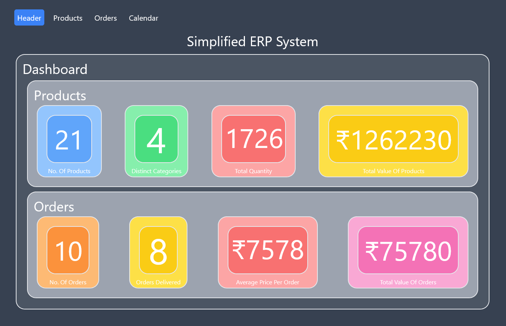

The website is made responsive , you can try it out.

### Products

On the Products page, you can view a list of existing products along with their details such as name, category, stock quantity, and price. You can also add new products, edit existing ones, and delete products.

You can see the Products page as-

#### 1. Edit

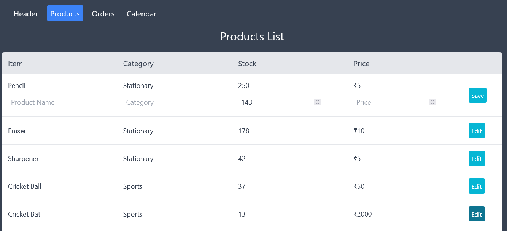
You can click on edit button and change any value , see this example.
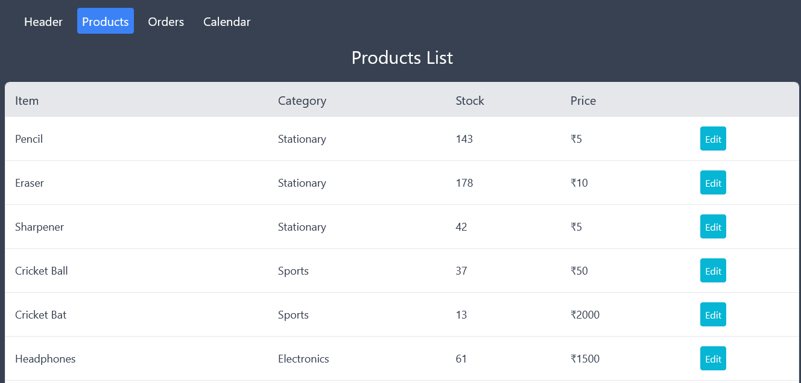
Click on save and its value will be saved.

Add and Delete buttons are provided below at the end of the product section.
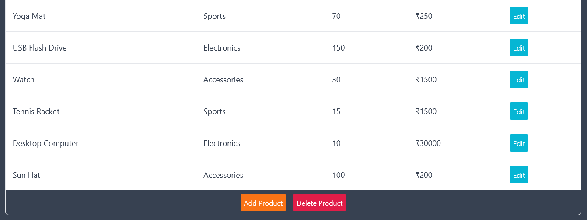

#### 2. Delete

Click on Delete its colour will change and then click on any item in the list. The item will get deleted.
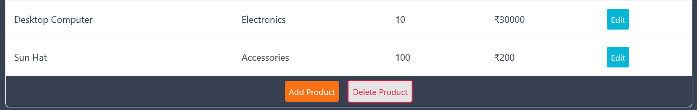
Here our sun hat got removed.
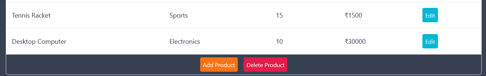

#### 3. Add

Click on the Add Button to add product.
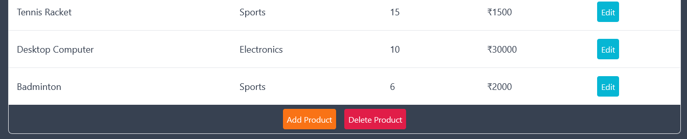
Fill the details and now our Badminton is added.


### Orders

The Orders page presents a list of orders, each showing the order ID, customer name, order date, order total, and order status. You can change the status of orders (e.g., from "Not Delivered" to "Delivered") and view more details about each order and also delete any order.

You can see the Orders page as-

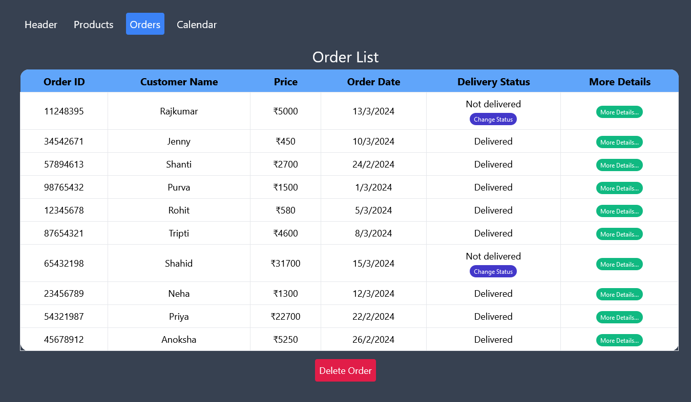
You can click on edit button and change any value , see this example.

#### 1. Change Delivery Status

Click on change status option to change the delivery status. Here we changed the status of Shahid's Order
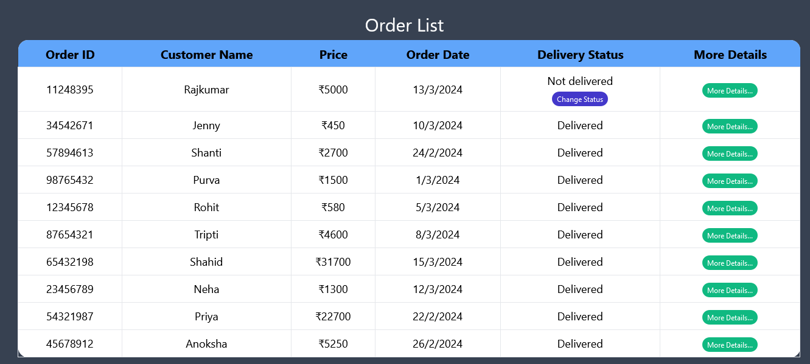
Click on save and its value will be saved.

#### 2. Delete

Its Delete button is also provided at the end.
Click on Delete its colour will change and then click on any item in the list. The item will get deleted.
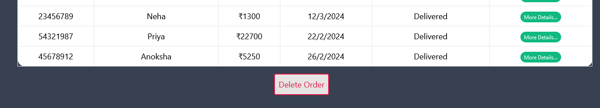
Here our Anoksha's order got removed.
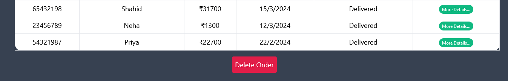

#### 3. More Details

Click on the More Details button to the order details. The order details will be shown at the bottom.

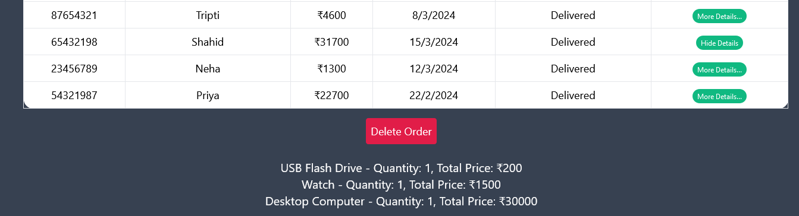
Here we can see what are the items that shahid has ordered.

### Calendar

The Calendar page displays a calendar with highlighted dates indicating the presence of orders. Clicking on a highlighted date reveals the orders scheduled for that date.

#### 1. Calendar Page

The Calendar Page is as follows

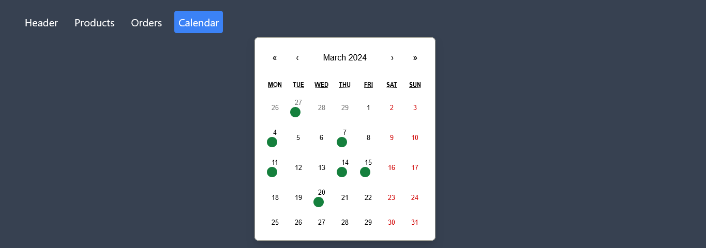
You can see the green dots which shows that these days had the delivery done.
Clicking on it will give the details of order delivery that day.
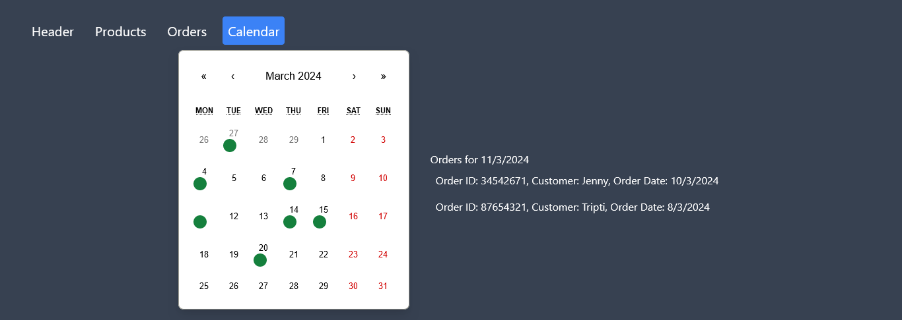

# Thanks For Visiting
